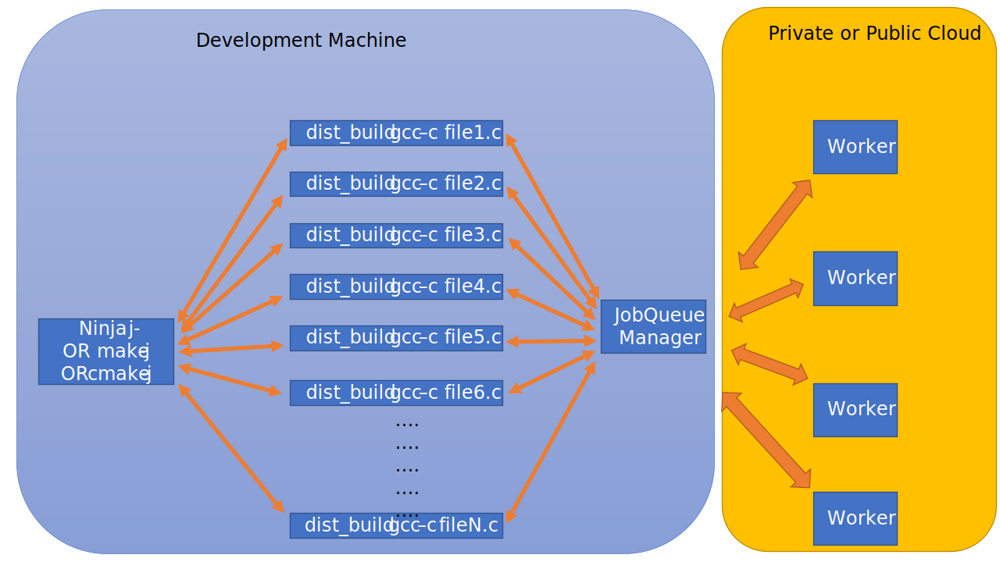

# Distributed builds

Faster compiles by using multiple machines in parallel to build your project.
For example, assume we have N files to compile and we have four machines.
Then each of the four machines receives a portion of the compile jobs and we get a 4x speedup:



To make the work distribution fair over the machines, we perform work-stealing.
The jobQueue machine maintains a queue of compiles yet-to-do.
Each worker, once idle, asks the JobQueue manager for work (the workers otherwise poll the syncer for new work)
It then fetches the command line to execute (here 'gcc -c fileX.c').


## Managing include files

Instead of pre-processing at the development machine (like [distcc](https://github.com/distcc/distcc)) the JobQueue manager sends all include files to all cloud machines.
This has the following reprocutions:
- header files are only read once,
- changes to header files must be propagated to the workers to keep them up-to-date.

To keep the headers up-to-date, the JobQueue manager keeps track of all changes using file-change notifications on windows and linux and uploads new versions on the fly.

**Note that dist_build attempts to create a sandbox for includes in $HOME/dist_build.**
All downloaded includes are copied there by the workers, complete with the path the include file came from.
When compiling, the compiler's invocation is examined to change the include paths to point to the downloaded location in the sandbox.

**Each time the syncer starts it will start copying the header files found in config.json's dirs variable over to the worker machines**.


## Security

All connections between processes worker <--> jobqueue <--> dist_build is via HTTPS.
A certificate for authentication between the processes should be re-generated for each installation.
The certificates are in src/certs and can be regenerated using the gen_self_signed_certs.sh script there.


## Handling python virtual environments

Because dist_build is written in python, it can be challenging to use in virtual environments.
We therefore can optionally run the dist_build script wrapped in an executable to workaround this.

To do so, execute the 'generate_dist_build_executable.sh' script.

## Installation

Prerequisites: 
    - python 3.8.3
    - pip
    - tested with Linux and Windows

```bash
pip install -r requirements.txt 
sh generate_dist_build_executable.sh
```

Next adapt the config.json to add your include dirs (in the config.json on the development machine) and prefered number of cores to use (on the build machines).


When running, the system will try to read ~/dist_build/config.json on both developer and cloud machines.
Hence, copy your config.json there and adapt as needed:

```json
{
    "hosts": [              
        "localhost:8443"
    ],
    "syncer": "https://localhost:5000",
    "dirs": [
        "/Users/rsvel/source/repos/include_syncer/tests"
    ],
    "num_cores": 4,
    "copied_already": [
        "/home/user/my_large_include_dir"
    ]
}
```

- The 'hosts' variable is read by the job-queue machine to find the workers.
- The 'syncer' variable is read by the dist_build script to find the JobQueue to push new jobs to.
- The 'syncer' variable is read by the workers to try to fetch jobs from.
- The 'num_cores' variable is read by the workers to find out how many cores to use locally for compilations (aka the number of concurrent jobs to run on a single worker).

Because copying large amount of header files each time the system starts is expensive, we have the "copied_already" array.
The process:
1) Copy the includes once to the workers
     - place the include path in "dirs" and start the syncer to let the system copy over the includes.
2) Add the include path to the 'copied_already' variable.
     - now the system will monitor for changes to these directories but will not copy them over


## Usage

##### Step 1.

On the build machines in your public/private cloud you use:

```bash
mkdir ~/dist_build
cp example_daemon_config.json ~/dist_build/config.json
< edit ~/dist_build/config.json >
python daemon.py 
```

##### Step 2.

To start the JobQueue manager, run this in a terminal on the machine you're doing development on:

```bash
mkdir ~/dist_build
cp example_dev_config.json ~/dist_build/config.json
< edit ~/dist_build/config.json >
python syncer.py
```

##### Step 3.

On your development machine, instead of calling gcc or cl.exe directly, prefix it with dist_build.exe.
For example:
```bash
gcc <compiler-args> -c test.c
```
becomes:
```bash
dist_build/src/dist/dist_build.exe gcc <compiler-args> -c test.c
```

Simulilarly, for microsoft's visual studio compiler, it becomes:

```bash
dist_build/src/dist/dist_build.exe /Program\ Files\ \(x86\)/Microsoft\ Visual\ Studio/2019/Community/VC/Tools/MSVC/14.29.30037/bin/Hostx64/x64/cl.exe \
        /I /Program\ Files\ \(x86\)/Windows\ Kits/10/Include/10.0.19041.0/ucrt \
        /I /Program\ Files\ \(x86\)/Microsoft\ Visual\ Studio/2019/Community/VC/Tools/MSVC/14.29.30037/include \
        /c \
        /Fo"build/" /EHsc \
        tests/hello.c
```


## Monitoring

You can query the status of a single worker using:

```bash
curl -k https://<IP>:8443/status
```

You can query the aggregate status over all workers by querying the JobManager:

```bash
curl -k https://<IP of syncer>:5000/status
```
where in a simple setup the IP of the syncer is localhost.
